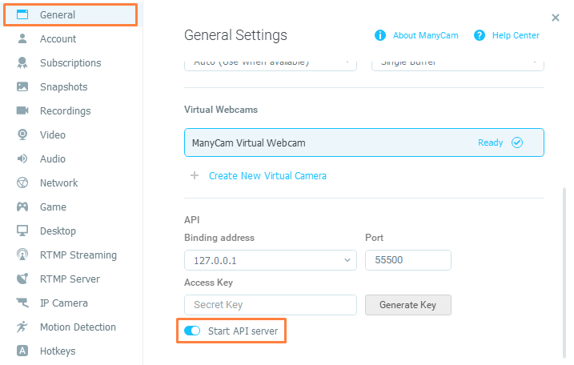
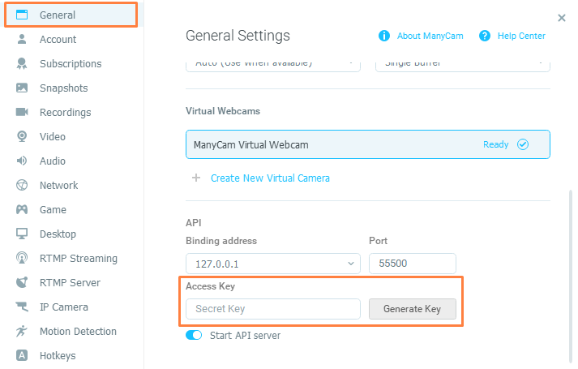

# About

## Quicklinks

-   🌐 **[ManyCam](https://manycam.com/)**

-   📝 **[Documentation](docs/index.md)**

-   💡 **[Examples](docs/examples.md)**

## ManyCam

ManyCam is one of the best solutions to take your remote lectures and broadcasts on streaming sites to the next level, as well as expand the capabilities of video conferencing applications. You can connect multiple cameras and other video sources such as mobile devices and presentations, use virtual backgrounds, add new video layers and scenes, broadcast your desktop, and more.

🌐 **[ManyCam](https://manycam.com/)**

In order to run API server, you need to switch toggle "Start API server" in ManyCam settings:



## ManyCam Javascript SDK

ManyCam Javascript SDK provides a way to dial with a ManyCam application from Javascript applications using **Websocket** protocol.

Watch the video how to control ManyCam application from the browser UI! 👇

[**Control ManyCam application from the custom web UI using ManyCam SDK.**](https://www.youtube.com/watch?v=xCxttK7UOCE&ab_channel=TomskSoft)

📝 **[Documentation](docs/index.md)**

## Promises based

All SDK methods return a promise resolving the result part of ManyCam API responses. If an error occurs, the promise is rejected with an Error object embedding the error part of the API response.
For the action that should return data such as `getCurrentPreset`, the property result contains class instance of requested data or array of instances.
For the control actions such as `showUI` or `setTransitionType`, the property result contains boolean `true`.
Any error must be caught either at the end of the `Promise` chain, or by using `async/await` and a `try...catch`.

> Note!
> Try always to await Promises to exclude data overriding in the same commands.

# Usage

## 🔑 Compatibility matrix

| ManyCam Version | SDK Version |
| --------------- | ----------- |
| 7.x.x           | 1.x.x       |

## 🚀 Getting started

### Installation

This SDK can be used either in NodeJS or in a browser.

#### Node.js

```
npm install manycam-sdk
```

Then require it:

```js
const ManyCamSDK = require("manycam-sdk");
```

or using destruction

```js
const { ManyCam } = require("manycam-sdk");
```

#### Browser

To run the SDK in the browser, you have to build it yourself by cloning this repository and running

```bash
$ npm install
$ npm run build
```

A `dist` directory will be created, containing a browser version of this SDK.

```html
<script type="text/javascript" src="dist/manycam.js"></script>
```

or use the CDN:

```html
<script type="text/javascript" src=""></script>
```

Then the ManyCam SDK will be available under the `ManyCamSDK` variable:

```html
<script>
	const manycam = new ManyCamSDK.ManyCam(settings);
	// ...
</script>
```

## 🏁 Start to work

When instantiating, you must create settings object containing `host`, `port` and `access_key` provided by Many Cam.

```js
const { ManyCam } = require("manycam-sdk");

let settings = {
	host: "ws://127.0.0.1",
	port: "55500",
	access_key: "access_key",
};
const manyCam = new ManyCam(settings);
```

`access_key` can be generated in settings menu of ManyCam as below:



Set up listeners:

```js
// Set up error listener
manyCam.onError((error) => {
	console.log(error.message);
});

// Set up notification listener
manyCam.onNotification((notification) => {
	console.log("Notification: ");
	console.log(notification);
});
```

Then you need to connect to ManyCam server:

```js
await manyCam.connect();
```

## ✏️ Set source example

```js
const { ManyCam, sources } = require("manycam-sdk");

manyCam
	.connect()
	.then(() => {
		run();
	})
	.catch((error) => console.log(error));

const run = async () => {
	// Get current preset
	let preset = await manyCam.getCurrentPreset();

	// Get layer in preset
	let layer = preset.layers[0];
	// or by pip number if layer exist
	// let layer = preset.getLayer(1);

	// Init youtube source and set it to layer
	let yt = new Source(sources.youtube, {
		url: "https://www.youtube.com/watch?v=GEWpQp1yW9U&ab_channel=ManyCam",
	});
	let answer = await layer.setSource(yt); // returns true
};
```

See more **[examples](docs/examples.md)** 👈
